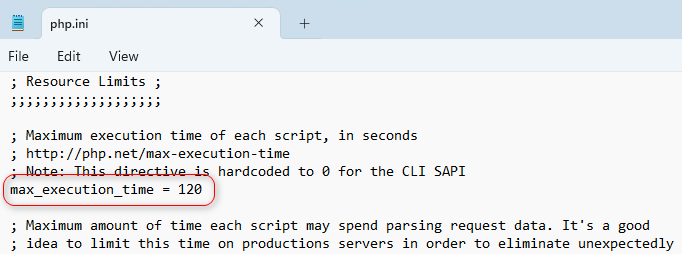

# Домашние задания
1. Установите WAMP сборку, если вы работаете под Windows (м.б. вам
   понадобится LAMP или MAMP, если вы используете другую операционную
   систему)
---
   

---
2. Узнайте каков объем памяти выделяется PHP-скрипту. Примечание: задание
   нужно сделать двумя способами — посмотреть в конфигурационном файле или
   получить параметр из php-функции.

---

   

   

---

3. Узнайте какова максимальная длительность выполнения PHP-скрипта.
   Примечание: см. предыдущую задачу.

---
   
   
   
---

4. Установите параметры из первых двух задач в значения, отличные от
   начальных. Убедитесь, что изменения применены и используются.

**max_execution_time** = 240
**memory_limit** = 512M

   

5. Вызовите в вашем скрипте функцию phpinfo() и поверхностно познакомьтесь с
   выведенными параметрами
6. Вызовите оператор echo с параметром «привет»; убедитесь в использовании
   нужной кодировки на сервере.
7. Проверьте вашу текущую версию PHP.
8. * Пропишите путь к PHP- интерпретатору в системной переменной PATH.
9. * Вызовите PHP-скрипт из консоли.
10. Распечатайте результат вызова функции date('d-m-Y H:i:s');
11. Испытайте работу всех PHP-тегов, которые доступны в вашей версии PHP
12. Возьмите один из своих HTML-файлов. Измените его расширение на .php,
    убедитесь в доступности файла на сервере.